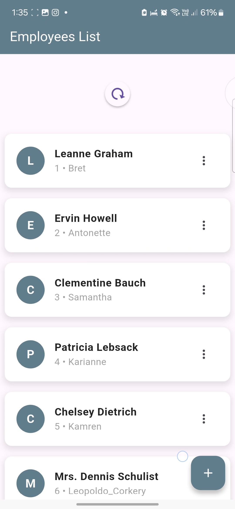
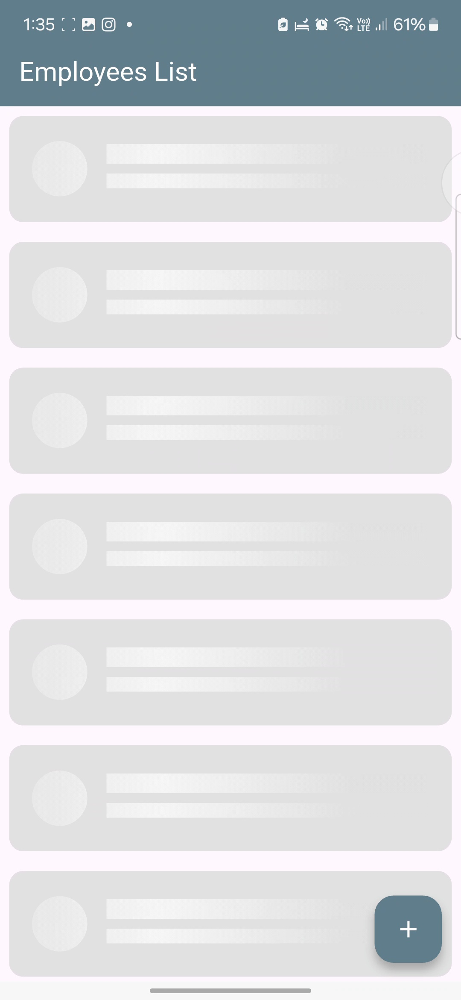
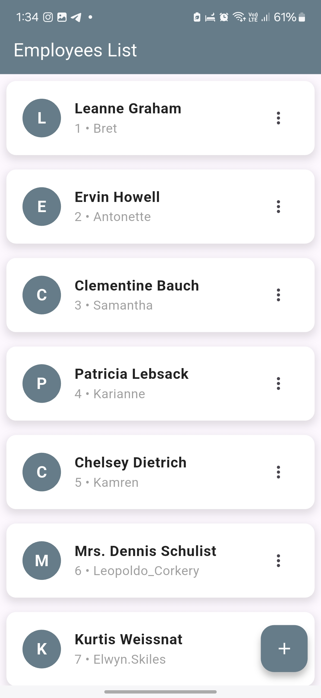
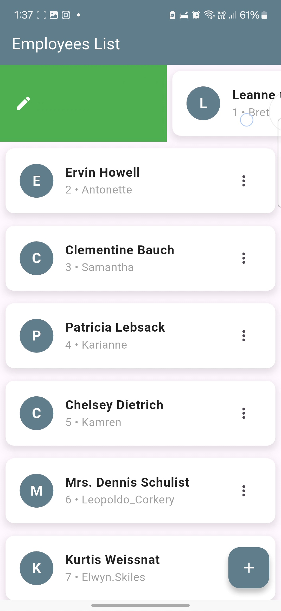
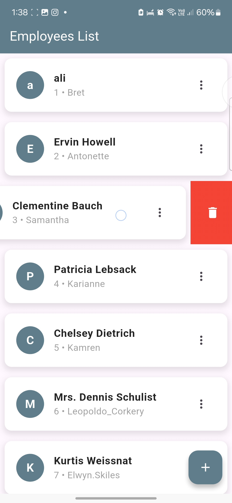
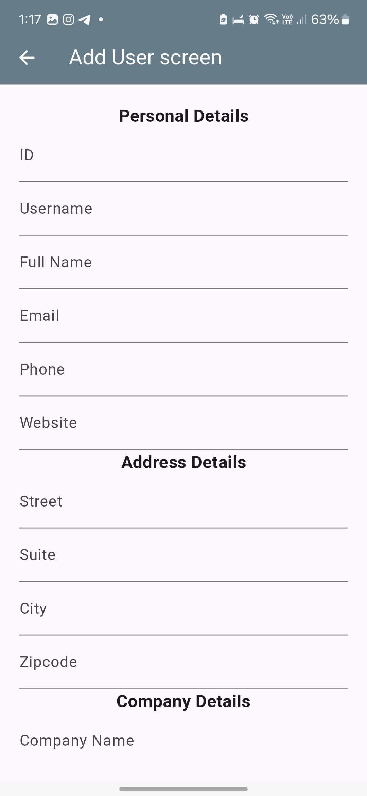
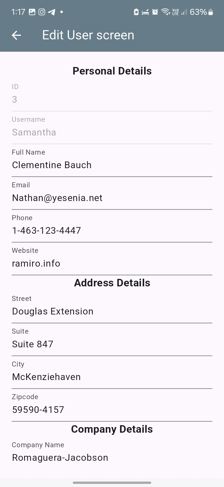
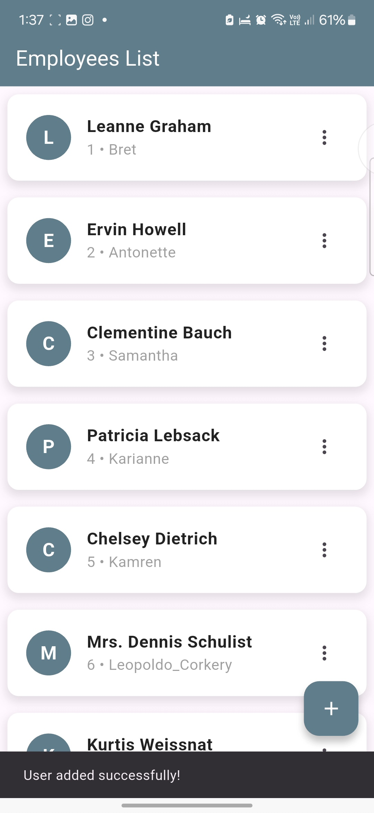
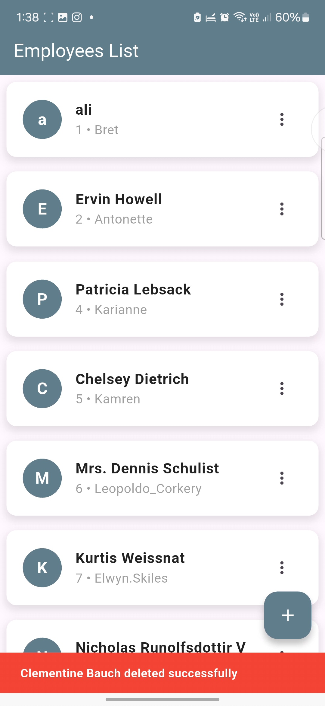
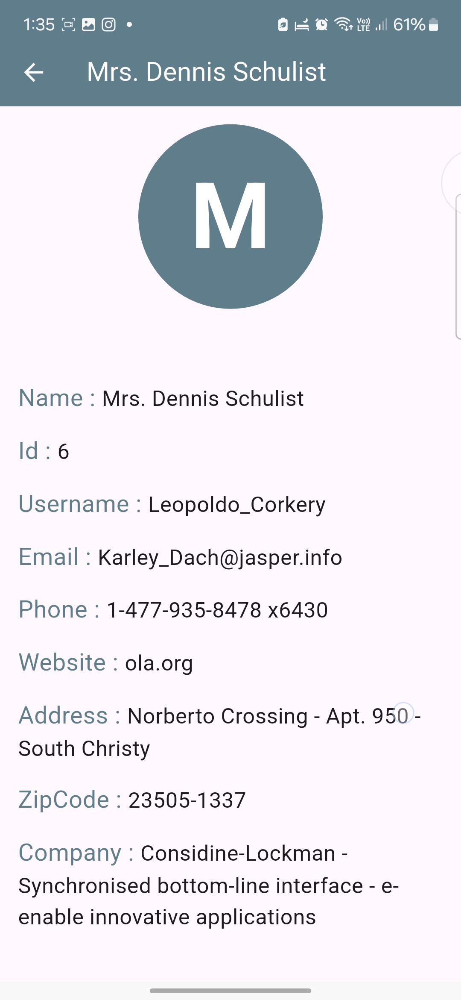

# sprints_user_profile_management

A new Flutter project.

## Overview

This project is a mobile application designed for User Profile Management with advanced features to manage user data.
The app have multiple functionalities like creating, fetching, updating, and deleting user profiles.
The project also include caching, error handling, and responsive UI.

## Features

- API & Data Handling

  1. Implement Dio requests for API.
  2. parsing and modeling JSON data..
  3. Error handling using try-catch.

- Add & Edit User

  4. Perform CRUD operations: Create, Read, Update, and Delete user profiles.
  5. caching data with shared preferences.

- User List Page 6. Build a responsive UI for listing, adding, and editing profiles.

- User Details
  7.Pass data between screens and manage states effectively.

## Dependencies

1. cupertino_icons: ^1.0.8
2. dio: ^5.7.0
3. shared_preferences: ^2.3.5
4. internet_connection_checker: ^3.0.1
5. custom_refresh_indicator: ^4.0.1
6. shimmer: ^3.0.0

## 📸 Screens

    
    
    
    

    
    
    
    

    
    

